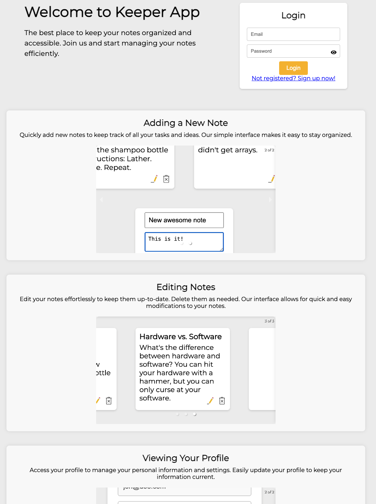

# PUC-Rio - Especialização em Desenvolvimento Web Full Stack
> Disciplina: Desenvolvimento Front-end Avançado

> Aluno: Rodrigo Alves Costa

# Keeper App

Keeper App is a simple note taking app built with React. It allows users to create, read, update, and delete notes. The app also has a simple access control system, in which only the user who created a note can edit or delete it. The user can edit their own profile by clicking on the profile icon in the top right corner of the screen.

For testing purposes, feel free to use the following credentials to view notes assigned to these users:
- Email: jon@doe.com / Password: 123456
- Email: jane@doe.com / Password: 123456
- Email: admin@keeper.app / Password: root

# Technologies
- React
- Icon8 and React Icons
- Vitest
- Figma (for design)

Figma Prototypes and Wireframes: [Keeper App](https://www.figma.com/design/9PjKA7Ly44BVJacovY3VeD/Keeper-App---Prototype-%26-Wireframes?node-id=38-2&t=3IbQ7A2t31dB7Ep0-1)

# How to run
1. Clone the repository
2. Run `npm install` to install the dependencies
3. Run `npm run dev` to start the development server
4. Open `http://localhost:5173` in your browser

# Live demo
You can see a 5-minute live demo of this project [here](https://www.loom.com/share/c55801bd859d489b8cbe9b9da1e138da)

# Screenshots
> Main page

> Registration page (sign up)

> Home page after login

> Create a new note

> Edit a note

> Delete a note

> Click on user's name and view options

> Edit user's profile (email is disabled)

